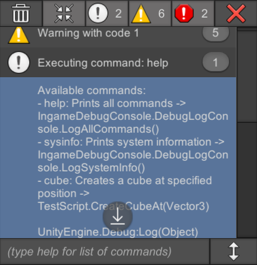

# In-game Debug Console for Unity 3D

 

**Available on Asset Store:** https://assetstore.unity.com/packages/tools/gui/in-game-debug-console-68068

**Forum Thread:** http://forum.unity3d.com/threads/in-game-debug-console-with-ugui-free.411323/

**Discord:** https://discord.gg/UJJt549AaV

**[GitHub Sponsors ☕](https://github.com/sponsors/yasirkula)**

## ABOUT

This asset helps you see debug messages (logs, warnings, errors, exceptions) runtime in a build (also assertions in editor) and execute commands using its built-in console. It also supports logging *logcat* messages to the console on Android platform.

User interface is created with **uGUI** and costs **1 SetPass call** (and 6 to 10 batches) when *Sprite Packing* is enabled. It is possible to resize or hide the console window during the game. Once the console is hidden, a small popup will take its place (which can be dragged around). The popup will show the number of logs that arrived since it had appeared. Console window will reappear after clicking the popup.


Console window is optimized using a customized recycled list view that calls *Instantiate* function sparingly. 

## INSTALLATION

There are 5 ways to install this plugin:

- import [IngameDebugConsole.unitypackage](https://github.com/yasirkula/UnityIngameDebugConsole/releases) via *Assets-Import Package*
- clone/[download](https://github.com/yasirkula/UnityIngameDebugConsole/archive/master.zip) this repository and move the *Plugins* folder to your Unity project's *Assets* folder
- import it from [Asset Store](https://assetstore.unity.com/packages/tools/gui/in-game-debug-console-68068)
- *(via Package Manager)* add the following line to *Packages/manifest.json*:
  - `"com.yasirkula.ingamedebugconsole": "https://github.com/yasirkula/UnityIngameDebugConsole.git",`
- *(via [OpenUPM](https://openupm.com))* after installing [openupm-cli](https://github.com/openupm/openupm-cli), run the following command:
  - `openupm add com.yasirkula.ingamedebugconsole`

## FAQ

- **New Input System isn't supported on Unity 2019.2.5 or earlier**

Add `ENABLE_INPUT_SYSTEM` compiler directive to **Player Settings/Scripting Define Symbols** (these symbols are platform specific, so if you change the active platform later, you'll have to add the compiler directive again).

- **"Unity.InputSystem" assembly can't be resolved on Unity 2018.4 or earlier**

Remove `Unity.InputSystem` assembly from **IngameDebugConsole.Runtime** Assembly Definition File's *Assembly Definition References* list.

- **"Receive Logcat Logs In Android" isn't working, it says "java.lang.ClassNotFoundException: com.yasirkula.unity.DebugConsoleLogcatLogger" in Logcat**

If you are sure that your plugin is up-to-date, then enable **Custom Proguard File** option from *Player Settings* and add the following line to that file: `-keep class com.yasirkula.unity.* { *; }`

## HOW TO

Simply place **IngameDebugConsole** prefab to your scene. Hovering the cursor over its properties in the Inspector will reveal explanatory tooltips.

While testing on Unity editor, right clicking a log entry will open the corresponding line in external script editor, similar to double clicking a log in Unity Console.

## COMMAND CONSOLE

### Executing Commands

You can enter commands using the input field at the bottom of the console. To see all available commands, simply type "*help*".

A command is basically a function that can be called from the console via the command input field. This function can be **static** or an **instance function** (non static), in which case, a living instance is required to call the function. The return type of the function can be anything (including *void*). If the function returns an object, it will be printed to the console. The function can also take any number of parameters; the only restriction applies to the types of these parameters. Supported parameter types are:

**Primitive types, enums, string, Vector2, Vector3, Vector4, Color, Color32, Vector2Int, Vector3Int, Quaternion, Rect, RectInt, RectOffset, Bounds, BoundsInt, GameObject, any Component type, arrays/Lists of these supported types**

Note that *GameObject* and *Component* parameters are assigned value using *GameObject.Find*.

To call a registered command, simply write down the command and then provide the necessary parameters. For example: 

`cube [0 2.5 0]`

To see the syntax of a command, see the help log:

`- cube: Creates a cube at specified position -> TestScript.CreateCubeAt(Vector3 position)`

Here, the command is *cube* and it takes a single *Vector3* parameter. This command calls the *CreateCubeAt* function in the *TestScript* script (see example code below for implementation details).

Console uses a simple algorithm to parse the command input and has some restrictions:

- Wrap strings with quotation marks ( " or ' )
- Wrap vectors with brackets ( \[\] ) or parentheses ( () )

However, there is some flexibility in the syntax, as well:

- You can provide an empty vector to represent Vector_.zero: \[\]
- You can enter 1 instead of true, or 0 instead of false
- You can enter `null` for null GameObject and/or Component parameters

### Registering Custom Commands

If all the parameters of a function are of supported types, you can register the function to the console in four different ways (all of these methods take optional string parameter(s) at the end to specify custom display names for the registered function's parameter(s)):

- **ConsoleMethod Attribute** *(not supported on UWP platform)*

Simply add **IngameDebugConsole.ConsoleMethod** attribute to your functions. These functions must be *public static* and must reside in a *public* class. These constraints do not apply to the other 3 methods.

```csharp
using UnityEngine;
using IngameDebugConsole;

public class TestScript : MonoBehaviour
{
	[ConsoleMethod( "cube", "Creates a cube at specified position" )]
	public static void CreateCubeAt( Vector3 position )
	{
		GameObject.CreatePrimitive( PrimitiveType.Cube ).transform.position = position;
	}
}
```

- **Strongly Typed Functions**

Use one of the `DebugLogConsole.AddCommand( string command, string description, System.Action method )` variants:

```csharp
using UnityEngine;
using IngameDebugConsole;

public class TestScript : MonoBehaviour
{
	void Start()
	{
		DebugLogConsole.AddCommand( "destroy", "Destroys " + name, Destroy );
		DebugLogConsole.AddCommand<Vector3>( "cube", "Creates a cube at specified position", CreateCubeAt );
		DebugLogConsole.AddCommand<string, GameObject>( "child", "Creates a new child object under " + name, AddChild );
	}

	void Destroy()
	{
		Destroy( gameObject );
	}

	public static void CreateCubeAt( Vector3 position )
	{
		GameObject.CreatePrimitive( PrimitiveType.Cube ).transform.position = position;
	}

	private GameObject AddChild( string name )
	{
		GameObject child = new GameObject( name );
		child.transform.SetParent( transform );

		return child;
	}
}
```

- **Static Functions (weakly typed)**

Use `DebugLogConsole.AddCommandStatic( string command, string description, string methodName, System.Type ownerType )`. Here, **methodName** is the name of the method in string format, and **ownerType** is the type of the owner class. It may seem strange to provide the method name in string and/or provide the type of the class; however, after hours of research, I found it the best way to register any function with any number of parameters and parameter types into the system without knowing the signature of the method.

```csharp
using UnityEngine;
using IngameDebugConsole;

public class TestScript : MonoBehaviour
{
	void Start()
	{
		DebugLogConsole.AddCommandStatic( "cube", "Creates a cube at specified position", "CreateCubeAt", typeof( TestScript ) );
	}
	
	public static void CreateCubeAt( Vector3 position )
	{
		GameObject.CreatePrimitive( PrimitiveType.Cube ).transform.position = position;
	}
}
```

- **Instance Functions (weakly typed)**

Use `DebugLogConsole.AddCommandInstance( string command, string description, string methodName, object instance )`:

```csharp
using UnityEngine;
using IngameDebugConsole;

public class TestScript : MonoBehaviour
{
	void Start()
	{
		DebugLogConsole.AddCommandInstance( "cube", "Creates a cube at specified position", "CreateCubeAt", this );
	}
	
	void CreateCubeAt( Vector3 position )
	{
		GameObject.CreatePrimitive( PrimitiveType.Cube ).transform.position = position;
	}
}
```

The only difference with *AddCommandStatic* is that, you have to provide an actual instance of the class that owns the function, instead of the type of the class.

### Removing Commands

Use `DebugLogConsole.RemoveCommand( string command )` or one of the `DebugLogConsole.RemoveCommand( System.Action method )` variants.

### Extending Supported Parameter Types

Use `DebugLogConsole.AddCustomParameterType( Type type, ParseFunction parseFunction, string typeReadableName = null )`:

```csharp
using UnityEngine;
using IngameDebugConsole;

public class TestScript : MonoBehaviour
{
	public class Person
	{
		public string Name;
		public int Age;
	}

	void Start()
	{
		// Person parameters can now be used in commands, e.g. ('John Doe' 18)
		DebugLogConsole.AddCustomParameterType( typeof( Person ), ParsePerson );
	}
	
	private static bool ParsePerson( string input, out object output )
	{
		// Split the input
		// This will turn ('John Doe' 18) into 2 strings: "John Doe" (without quotes) and "18" (without quotes)
		List<string> inputSplit = new List<string>( 2 );
		DebugLogConsole.FetchArgumentsFromCommand( input, inputSplit );

		// We need 2 parameters: Name and Age
		if( inputSplit.Count != 2 )
		{
			output = null;
			return false;
		}

		// Try parsing the age
		object age;
		if( !DebugLogConsole.ParseInt( inputSplit[1], out age ) )
		{
			output = null;
			return false;
		}

		// Create the resulting object and assign it to output
		output = new Person()
		{
			Name = inputSplit[0],
			Age = (int) age
		};

		// Successfully parsed!
		return true;
	}
}
```

To remove the custom parameter type, you can use `DebugLogConsole.RemoveCustomParameterType( Type type )`.
