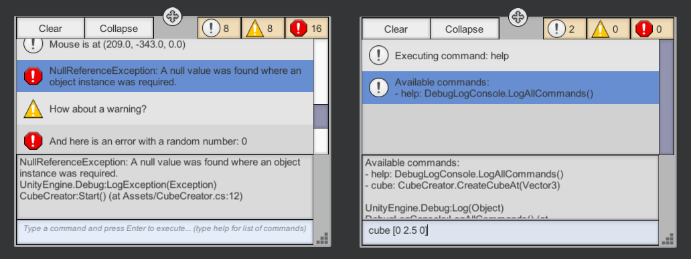
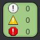
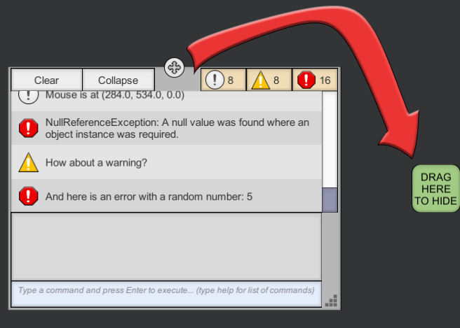

# In-game Debug Console for Unity 3D

 

**Available on Asset Store:** https://assetstore.unity.com/packages/tools/gui/in-game-debug-console-68068

**Forum Thread:** http://forum.unity3d.com/threads/in-game-debug-console-with-ugui-free.411323/

## ABOUT

This asset helps you see debug messages (logs, warnings, errors, exceptions) runtime in a build (also assertions in editor) and execute commands using its built-in console. It also supports logging *logcat* messages to the console on Android platform.

User interface is created with **uGUI** and costs **1 SetPass call** (and 6 to 10 batches) when *Sprite Packing* is enabled. It is possible to resize or hide the console window during the game. Once the console is hidden, a small popup will take its place (which can be dragged around). The popup will show the number of logs that arrived since it had appeared. Console window will reappear after clicking the popup.



Console window is optimized using a customized recycled list view that calls *Instantiate* function sparingly. 

## HOW TO

Simply import [IngameDebugConsole.unitypackage](https://github.com/yasirkula/UnityIngameDebugConsole/releases) to your project and place **IngameDebugConsole** prefab to your scene. You may want to tweak the following settings:

- **Singleton:** if enabled, console window will persist between scenes (recommended). If, however, you don't want the console on each scene, then deselect this option and manually drag & drop the DebugLogCanvas prefab to the scenes you want
- **Enable Popup:** if disabled, no popup will be shown when the console window is hidden
- **Start In Popup Mode:** if enabled, console will be initialized as a popup
- **Toggle With Key:** if enabled, pressing the **Toggle Key** will show/hide (i.e. toggle) the console window at runtime
- **Clear Command After Execution:** if enabled, the command input field at the bottom of the console window will automatically be cleared after entering a command. If you want to spam a command, or make small tweaks to the previous command without having to write the whole command again, then deselect this option
- **Command History Size:** console keeps track of the previously entered commands, this value determines how many will be remembered (you can scroll through the history via up and down arrow keys while the command input field is focused)
- **Receive Logcat Logs In Android:** if enabled, on Android platform, logcat entries of the application will also be logged to the console with the prefix "*LOGCAT:*". This may come in handy especially if you want to access the native logs of your Android plugins (like *Admob*)
- **Logcat Arguments:** on Android, if Logcat logs are enabled, native logs will be filtered using these arguments. If left blank, all native logs of the application will be logged to the console. If you want to, for example, see Admob's logs only, you can enter **-s Ads** here
- **Ignore Screen Cutout:** if disabled, on Android and iOS devices with notch screens, the console window will be repositioned so that the cutout(s) don't obscure it
- **Max Log Length:** if a log is longer than this limit, it will be truncated. This helps avoid reaching Unity's 65000 vertex limit for UI canvases

While testing on Unity editor, right clicking a log entry will open the corresponding line in external script editor, similar to double clicking a log in Unity Console.

## COMMAND CONSOLE

### Executing Commands

You can enter commands using the input field at the bottom of the console. Initially, only "*help*" and "*sysinfo*" commands are available.

A command is basically a function that can be called from the console via the command input field. This function can be **static** or an **instance function** (non static), in which case, a living instance is required to call the function. The return type of the function can be anything (including *void*). If the function returns an object, it will be printed to the console. The function can also take any number of parameters; the only restriction applies to the types of these parameters. Supported parameter types are:

**Primitive types, string, Vector2, Vector3, Vector4, GameObject, any Component type**

Note that *GameObject* and *Component* parameters are assigned value using *GameObject.Find*.

To call a registered command, simply write down the command and then provide the necessary parameters. For example: 

`cube [0 2.5 0]`

To see the syntax of a command, see the help log:

`- cube: Creates a cube at specified position -> TestScript.CreateCubeAt(Vector3)`

Here, the command is *cube* and it takes a single *Vector3* parameter. This command calls the *CreateCubeAt* function in the *TestScript* script (see example code below for implementation details).

Console uses a simple algorithm to parse the command input and has some restrictions:

- Don't put an f character after a float parameter
- Wrap strings with quotation marks ( " or ' )
- Wrap vectors with brackets ( \[\] ) or parentheses ( () )

However, there is some flexibility in the syntax, as well:

- You can provide an empty vector to represent Vector_.zero: \[\]
- You can enter 1 instead of true, or 0 instead of false
- You can enter 'null' for null GameObject and/or Component parameters

### Registering Custom Commands

If all the parameters of a function are of supported types, you can register the function to the console in four different ways:

- **ConsoleMethod Attribute** *(not supported on UWP platform)*

Simply add **IngameDebugConsole.ConsoleMethod** attribute to your functions. These functions must be *public static* and must reside in a *public* class. These constraints do not apply to the other two methods.

```csharp
using UnityEngine;
using IngameDebugConsole;

public class TestScript : MonoBehaviour
{
	[ConsoleMethod( "cube", "Creates a cube at specified position" )]
	public static void CreateCubeAt( Vector3 position )
	{
		GameObject.CreatePrimitive( PrimitiveType.Cube ).transform.position = position;
	}
}
```

- **Strongly Typed Functions**

Use one of the `DebugLogConsole.AddCommand( string command, string description, System.Action method )` variants:

```csharp
using UnityEngine;
using IngameDebugConsole;

public class TestScript : MonoBehaviour
{
	void Start()
	{
		DebugLogConsole.AddCommand( "destroy", "Destroys " + name, Destroy );
		DebugLogConsole.AddCommand<Vector3>( "cube", "Creates a cube at specified position", CreateCubeAt );
		DebugLogConsole.AddCommand<string, GameObject>( "child", "Creates a new child object under " + name, AddChild );
	}

	void Destroy()
	{
		Destroy( gameObject );
	}

	public static void CreateCubeAt( Vector3 position )
	{
		GameObject.CreatePrimitive( PrimitiveType.Cube ).transform.position = position;
	}

	private GameObject AddChild( string name )
	{
		GameObject child = new GameObject( name );
		child.transform.SetParent( transform );

		return child;
	}
}
```

- **Static Functions (weakly typed)**

Use `DebugLogConsole.AddCommandStatic( string command, string description, string methodName, System.Type ownerType )`. Here, **methodName** is the name of the method in string format, and **ownerType** is the type of the owner class. It may seem strange to provide the method name in string and/or provide the type of the class; however, after hours of research, I found it the best way to register any function with any number of parameters and parameter types into the system without knowing the signature of the method.

```csharp
using UnityEngine;
using IngameDebugConsole;

public class TestScript : MonoBehaviour
{
	void Start()
	{
		DebugLogConsole.AddCommandStatic( "cube", "Creates a cube at specified position", "CreateCubeAt", typeof( TestScript ) );
	}
	
	public static void CreateCubeAt( Vector3 position )
	{
		GameObject.CreatePrimitive( PrimitiveType.Cube ).transform.position = position;
	}
}
```

- **Instance Functions (weakly typed)**

Use `DebugLogConsole.AddCommandInstance( string command, string description, string methodName, object instance )`:

```csharp
using UnityEngine;
using IngameDebugConsole;

public class TestScript : MonoBehaviour
{
	void Start()
	{
		DebugLogConsole.AddCommandInstance( "cube", "Creates a cube at specified position", "CreateCubeAt", this );
	}
	
	void CreateCubeAt( Vector3 position )
	{
		GameObject.CreatePrimitive( PrimitiveType.Cube ).transform.position = position;
	}
}
```

The only difference with *AddCommandStatic* is that, you have to provide an actual instance of the class that owns the function, instead of the type of the class.

### Removing Commands

Use `DebugLogConsole.RemoveCommand( string command )`.
